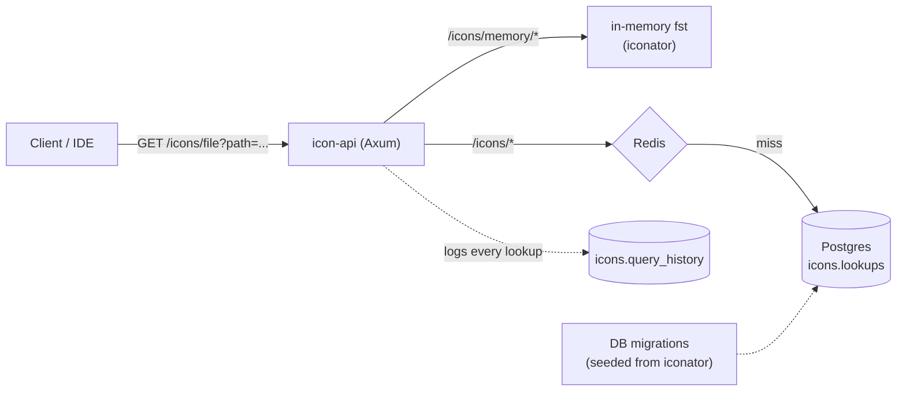

# Iconator (Mainmatter test)

A small HTTP service that answers one question: *"which icon goes next to this file or folder?"* - the lookup an IDE does to render its project tree. You give it a path, it gives you back a numeric icon id (each id maps to an SVG under `libs/iconator/icons/`).

The interesting part is that it answers that question **two ways**, side by side, so you can compare them:

- **In memory** - straight from the `iconator` crate's [fst](https://docs.rs/fst) maps, baked into the binary. No database, no cache, sub-millisecond.
- **Postgres + Redis** - a cache-aside read backed by a real database, with every lookup written to an audit log.

Both are seeded from the same source data, so they always agree. Which one you'd actually ship depends on the shape of the problem - more on that in [Design notes](#design-notes).

## Architecture



The service is a Cargo workspace:

- `services/api/server` - the `icon-api` binary (Axum).
- `libs/iconator` - the given icon lookup tables + `get_icon_for_file/folder`.
- `libs/postgres`, `libs/redis` - pooled data access. Postgres queries go through the [Diesel](https://diesel.rs) ORM (compile-time-checked, no raw SQL in the handlers); Redis uses deadpool.
- `libs/types` - the request/response contract, shared by the server and the SDK.
- `libs/sdk` - a typed async client (`IconClient`).
- `libs/telemetry`, `libs/utils` - metrics/tracing and shared helpers.

## Prerequisites

- Rust 1.92+ (see `rust-toolchain`)
- Docker & Docker Compose
- [Tilt](https://tilt.dev/) for local orchestration
- bun.js (pre-commit hooks, formatting, linting)
- `cargo-nextest`, `taplo`, `cargo-machete`

## Getting started

### 1. Tooling

```bash
./scripts/setup.sh
```

Installs the cargo tooling (nextest, taplo, machete, diesel_cli, ...), bun, and the pre-commit hooks. Check the script if you'd rather install things yourself.

### 2. Environment

```bash
cp .env.sample .env
```

The defaults work out of the box. The icon data is seeded automatically by the DB migrations on startup, so there's no data file to point at.

`POSTGRES_USER` / `POSTGRES_PASSWORD` / `POSTGRES_DB` are the source of truth for the database; `DATABASE_URL` (and the optional `DATABASE_RO_URL`) is what the app and the diesel CLI read.

### 3. Dependencies

```bash
bun install
```

Pulls in husky, commitlint, prettier, and markdownlint, and wires up the pre-commit hooks.

### 4. Run it

**Infra locally, API on your machine** (fast iteration - no image rebuilds):

```bash
tilt up local-api-testing      # Postgres, Redis, monitoring
cargo run --bin icon-api       # in another terminal
```

**Everything in Docker:**

```bash
tilt up api
```

The API listens on `API_SERVICE_PORT` (default `50051`).

> **Degraded mode:** startup is resilient. If Postgres or Redis isn't reachable at boot, the service logs it and starts anyway - the in-memory endpoints keep serving, DB-backed endpoints return `503`, and `/health` reports per-component status.

### 5. Swagger / OpenAPI

- Swagger UI: <http://localhost:50051/swagger-ui>
- OpenAPI spec: <http://localhost:50051/api-docs/openapi.json>

## API

Everything is under `/api/icons/v1`. Each lookup takes a `path` query parameter and returns `{ path, iconId, found, source }`. A path with no matching icon is **not** an error - you get `200` with `iconId: null` (the client falls back to a default icon).

- `GET /icons/file?path=<path>` - file icon, via Postgres + Redis
- `GET /icons/folder?path=<path>` - folder icon, via Postgres + Redis
- `GET /icons/memory/file?path=<path>` - file icon, from the in-memory maps
- `GET /icons/memory/folder?path=<path>` - folder icon, from the in-memory maps
- `GET /icons/history` - the last 10 DB-backed lookups

```bash
curl -G http://localhost:50051/api/icons/v1/icons/file --data-urlencode 'path=./src/main.rs'
# {"path":"./src/main.rs","iconId":525,"found":true,"source":"database"}
```

A typed client for all of this lives in `libs/sdk` (`IconClient`).

## How it works

On startup the migrations run and seed `icons.lookups` from `libs/iconator` (extensions, exact file names, folder names, each pointing at an icon id). Resolution matches `iconator` exactly: a file matches on its exact name first, then its extension; a folder matches on its exact name.

The DB endpoints read through a read-only pool, cache the result in Redis (misses included, so unknown paths don't keep hitting Postgres), and log the lookup to `icons.query_history`. The in-memory endpoints skip all of that and probe the fst maps directly. Same seed data, same rules - identical answers.

## Testing

```bash
make test            # nextest, whole workspace
make test-verbose    # with full status output
make test-package PKG=iconator
```

The lookup expectations live in `libs/iconator`'s unit tests (`.rs -> 525`, `.ts -> 633`, `src -> 1054`, ...). There's also a Postman collection under `postman/` if you'd rather click around.

## Formatting & linting

```bash
make fmt    # rustfmt, taplo (TOML), prettier, markdownlint
make lint   # fmt check, clippy -D warnings, machete, prettier, markdown
```

## Troubleshooting

**`Bind for 0.0.0.0:5432 failed: port is already allocated`**
Something else already owns 5432 (or 6379) - often another project's Postgres/Redis, or a local install. Stop it, or remap this project's ports in `docker-compose.yml` (e.g. `5433:5432`) and update `DATABASE_URL`/`REDIS_URL` for host runs.

**`database "icon_api" does not exist`**
`POSTGRES_DB` only creates the database when the data volume is *empty*. If the volume was initialized under a different name, recreate it: `docker compose down -v && tilt up api` (this wipes the reproducible seed data and re-initializes).

**Grafana exits with `renderer_token is not allowed for production settings`**
The image renderer needs a non-default token. Set `GRAFANA_RENDERER_TOKEN` in `.env` (it's wired to both grafana and the renderer in `docker-compose.yml`).

**`diesel: command not found` (the `db-migrations` Tilt resource)**
It's optional - the app applies migrations itself on boot. If you want the standalone runner, `cargo install diesel_cli --no-default-features --features postgres` (needs `libpq`: `brew install libpq` first on macOS).

**Nothing starts / all Tilt resources disabled**
The Tiltfile gates resources on the argument you pass. Use `tilt up api` (full stack) or `tilt up local-api-testing` (infra only) - a bare `tilt up` enables nothing.

## Design notes

### Choices and tradeoffs

- **Axum** for the server: mature, built on `tower`/`hyper`, clean extractors, and a first-class `utoipa` OpenAPI integration for the Swagger UI.
- **In-memory is the right default for this data.** The dataset is static and tiny (~2,200 entries), so an fst probe in the binary beats a network round-trip every time. I still built the Postgres + Redis path because it's the pattern that earns its keep the moment the icon set grows, needs updating without a redeploy, or wants an audit trail - and because comparing the two is half the point of the exercise.
- **Diesel (ORM) + `diesel-async` + bb8** - queries are written against Diesel's type-safe query builder rather than raw SQL, so they're checked at compile time; bb8 pools the connections, with a separate read-only pool so reads can later move to a replica (`DATABASE_RO_URL`).
- **One `icons.lookups` table** keyed by `(kind, name)` instead of three near-identical tables - one model, one query path.
- **A shared `types` crate** holds the wire contract so the server and the SDK physically cannot drift.
- **Resilient startup** and **panic-safe lookups** (the given `iconator` used `unwrap()` on untrusted input; now it returns `None`).
- **Known shortcut:** history is written on the request path. Fine at this scale; I'd move it off-thread or batch it before it mattered.

### Productionizing

- **Deploy** as a multi-stage Docker image (cargo-chef layer caching) on Kubernetes. It's stateless, so scale horizontally - the in-memory path needs nothing, the DB path leans on the pool and read replicas. Run migrations as a pre-deploy job, not on boot.
- **Config & secrets** are 12-factor; `utils::secrets` already abstracts a secret source (e.g. AWS Secrets Manager) so credentials never sit in plaintext.
- **Observability** ships in the box: Prometheus `/metrics`, Grafana dashboards, structured JSON tracing with spans around DB calls, Sentry capture for 5xx, and a `/health` endpoint wired for k8s probes.
- **Hardening** before real traffic: auth (API key/JWT), rate limiting, tighter CORS, TLS at the ingress, and a retention policy for `icons.query_history`.

### Where I'd take it next

- **Authentication & access control.** The service is wide open today. Before it's exposed beyond a trusted network I'd add authentication (JWT or API keys for service-to-service, OAuth for first-party clients), scoped per-client rate limiting, and audit who's calling what - the `query_history` table is already a natural place to hang that off.
- **Metrics that matter:** request-rate and latency histograms per endpoint, cache hit/miss ratio, and DB pool saturation - enough to actually quantify the in-memory vs DB tradeoff under load.
- **A batch endpoint.** An IDE renders a whole directory at once; resolving N paths in one request (and one round-trip) is the real-world hot path.
- **HTTP caching.** The data is effectively immutable between deploys, so `ETag`/`Cache-Control` would let clients and CDNs skip the service entirely.
- **Make the DB path pay off:** hot-reload the icon set without a redeploy, plus an admin endpoint to add or override mappings - the thing the in-memory build can't do.
- **Async/batched history writes** (or drop the row and keep a counter) and time-based partitioning for retention.
- **Load-test both backends** to put real numbers behind the "in-memory wins here" claim.
